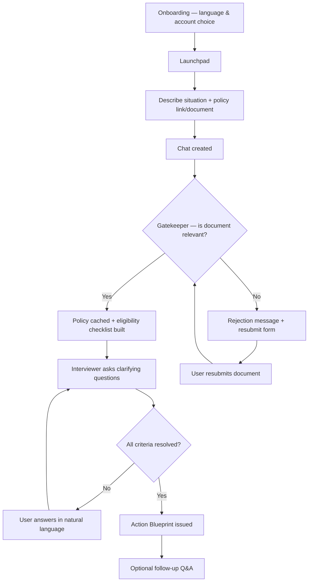
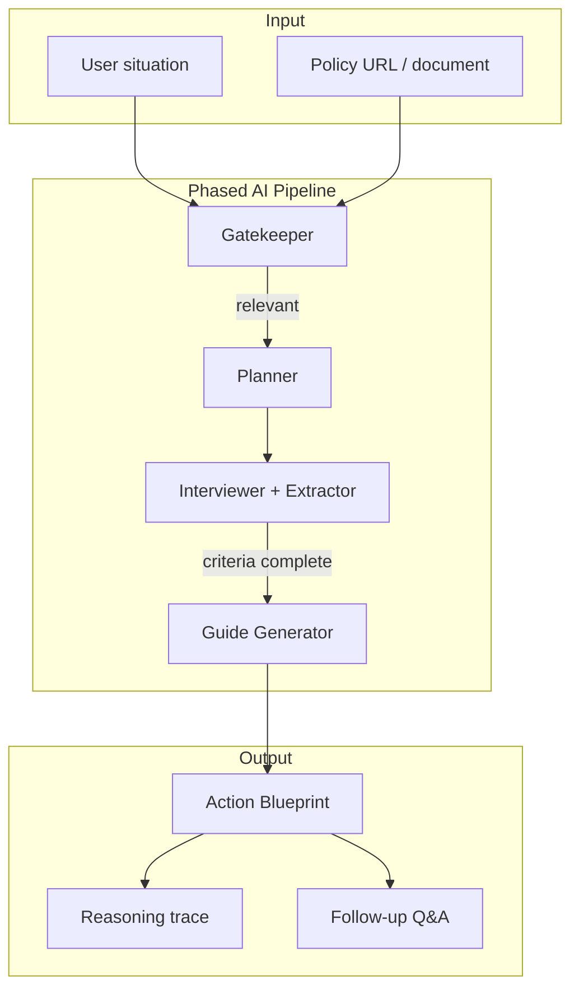
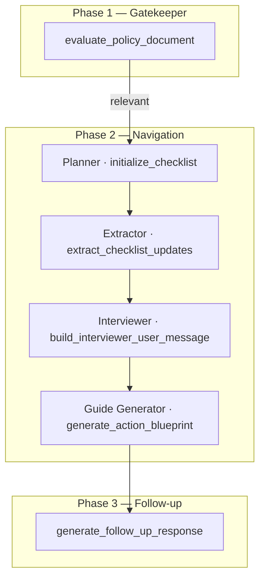

# Konya

Konya is an AI-powered benefits navigator that helps people understand whether they **may qualify** for a public support program and what to do next. Users bring the official policy document or link that applies to their case. Konya interprets eligibility rules in plain language, guides them through a conversational interview, and produces a structured **Action Blueprint**.

---

## The Problem

Public support systems — food assistance, student aid, childcare subsidies, healthcare programs, emergency relief — are often fragmented and written in bureaucratic language. Under stress or time pressure, people struggle to move from *"I found a policy"* to *"Does this apply to me?"* and *"What should I do next?"*

Most tools list programs. They do not help users **interpret rules** for a specific policy they already have in hand.

---

## The Solution

Konya uses a **Bring Your Own Policy (BYOP)** approach. There is no proprietary program database. The system reads the user's source document, extracts eligibility criteria into an internal checklist, asks focused questions in plain language, and generates an Action Blueprint with preparation steps and next actions.

| Konya does | Konya does not |
|------------|----------------|
| Interpret rules from the user's policy | Act as a program directory |
| Guide users through eligibility questions | Guarantee outcomes |
| Produce hedged, actionable next steps | Submit applications or provide legal advice |

**Languages:** English · Kiswahili · Sheng

**Built for:** students, workers, caregivers, families, and community case managers navigating complex systems under time pressure.

---

## User Flow



### Step-by-step

1. **Onboarding (once)** — Introduction, language (EN / SW / Sheng), guest or account
2. **Launchpad** — User describes situation + supplies policy URL and/or document (PDF, Word, text, image)
3. **Gatekeeper** — AI checks **topical relevance only** (not whether user qualifies)
4. **Planner** — Extracts eligibility criteria into an internal checklist; pre-fills from opening situation where possible
5. **Interviewer + Extractor loop** — Focused questions; user answers in plain language; checklist updates; live progress strip
6. **Action Blueprint** — Conclusion, What You Need to Prepare, Next Steps (+ disclaimer)
7. **Reasoning disclosure** — User may expand **"How we reached this"**
8. **Follow-up** — Post-blueprint Q&A grounded only in cached policy text

---

## Architecture



**End-to-end flow:** user input → AI reasoning over verified policy text → actionable output (Blueprint + next steps).

All AI logic is orchestrated in `navigator/services/featherless_ai.py`.



| Phase | Purpose |
|-------|---------|
| **Gatekeeper** | Accept or reject the policy source on topical relevance |
| **Planner** | Build an eligibility checklist from verified policy text |
| **Extractor** | Update the checklist from user answers (heuristics + LLM) |
| **Interviewer** | Ask the next relevant question in conversational copy |
| **Guide Generator** | Produce the Action Blueprint when all criteria are resolved |
| **Follow-up** | Answer questions using only the cached policy document |

**Stack:** Django 5 · Featherless AI (Llama 3.1 8B Instruct) · SQLite · Tailwind CSS

---

## Responsible AI

Konya is designed as decision **support**, not decision **authority**.

- Outputs use hedged language — *"may qualify"* — never a guaranteed determination
- All rules are grounded in the user's supplied policy, not a hidden database
- Users can review *"How we reached this"* reasoning before acting
- **Human-in-the-loop:** Konya does not make final eligibility decisions or submit applications; users verify with the official authority

---

## Getting Started

**Prerequisites:** Python 3.11+, a Featherless API key

```bash
# 1. Clone and enter the project
cd Konya

# 2. Create and activate a virtual environment
python -m venv .venv
.venv\Scripts\activate          # Windows
# source .venv/bin/activate     # macOS / Linux

# 3. Install dependencies
pip install -r requirements.txt

# 4. Configure environment
copy .env.example .env          # Windows
# cp .env.example .env          # macOS / Linux
# Edit .env and set FEATHERLESS_API_KEY

# 5. Initialize the database and translations
python manage.py migrate
python manage.py compilemessages

# 6. Start the development server
python manage.py runserver
```

Open **http://127.0.0.1:8000**, complete onboarding, and start a navigation from the Launchpad with a policy URL or document.

---

## Testing

```bash
python manage.py test navigator.tests
```

The test suite covers interview logic across common scenarios — age parsing, enrollment, employment status, solo vs. team flows, dependency skipping, and blueprint readiness.
