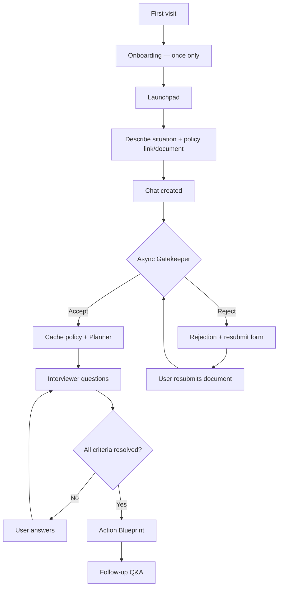
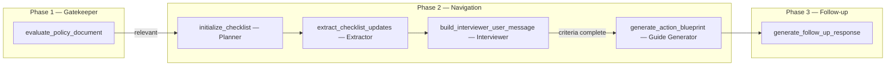

# Konya Documentation

Konya is a **Bring Your Own Policy (BYOP)** social-policy navigator. Users describe their personal situation, provide an official policy link or supporting document, and Konya guides them through eligibility questions grounded in that document—ending with an **Action Blueprint** and optional follow-up Q&A.

This document explains what the app does, how it is built, and how the AI workflow operates end to end.

---

## Table of Contents

1. [What Konya Does](#what-konya-does)
2. [Technology Stack](#technology-stack)
3. [Project Structure](#project-structure)
4. [User Journey](#user-journey)
5. [AI Workflow](#ai-workflow)
6. [Data Model](#data-model)
7. [How Key Concerns Are Handled](#how-key-concerns-are-handled)
8. [HTTP Routes & Endpoints](#http-routes--endpoints)
9. [Environment Configuration](#environment-configuration)
10. [Admin & Operations](#admin--operations)

---

## What Konya Does

Konya helps people navigate social policy programs by:

1. **Reading a user-provided policy** (URL or uploaded document)—not a generic knowledge base.
2. **Checking relevance** so the document actually applies to the user's stated situation.
3. **Extracting eligibility criteria** from the policy text.
4. **Asking focused clarifying questions** until criteria are resolved.
5. **Issuing an Action Blueprint** with a conclusion and practical next steps.
6. **Answering follow-up questions** strictly grounded in the cached policy document.

Konya does **not** submit applications, grant benefits, or act as a legal adjudicator. It provides informational guidance based on the document the user supplies.

---

## Technology Stack

| Layer | Technology |
|--------|------------|
| Backend | Django 5.2 (Python) |
| Database | SQLite (development) |
| AI Provider | [Featherless AI](https://featherless.ai) — OpenAI-compatible chat completions API |
| Default model | `meta-llama/Meta-Llama-3.1-8B-Instruct` (configurable via env) |
| Frontend | Server-rendered Django templates + Tailwind CSS (CDN) + vanilla JavaScript |
| Document parsing | `pypdf` (PDF), `python-docx` (Word), plain text, image placeholders |
| URL fetching | `requests` + `BeautifulSoup` |
| Markdown rendering | `marked.js` (client) + `markdown` (server utilities) |
| i18n | Django gettext — English, Kiswahili, Sheng |

---

## Project Structure

```
Konya/
├── config/                  # Django project settings, root URLs, WSGI
├── accounts/                # User profiles, language preferences, auth helpers
│   ├── models.py            # UserProfile (language, onboarding_completed)
│   ├── i18n.py              # Language & onboarding session/profile logic
│   └── backends.py          # Email-as-username authentication
├── navigator/               # Core application
│   ├── models.py            # Chat, Message
│   ├── views.py             # All page & API views
│   ├── forms.py             # Launchpad, policy resubmit, auth forms
│   ├── services/
│   │   └── featherless_ai.py # AI orchestration (Gatekeeper → Planner → …)
│   ├── document_files.py    # Allowed upload types & validation
│   ├── rate_limit.py        # Cache-based request rate limiting
│   ├── admin.py             # Chat & Message admin
│   ├── middleware.py        # UserLanguageMiddleware
│   └── templates/navigator/ # UI templates
├── locale/                  # Translation files (en, sw, sheng)
├── media/policy_docs/       # Uploaded policy files
└── konya-documentation.md   # This file
```

---

## User Journey



### 1. Onboarding (first visit only)

Three steps:

1. **What is Konya?** — product introduction
2. **Language selection** — English, Kiswahili, or Sheng
3. **Account or guest** — sign up, log in, or continue as guest

Onboarding completion is stored in:

- **Guest users:** Django session (`onboarding_complete`)
- **Authenticated users:** `UserProfile.onboarding_completed` (persisted in database)

Once completed, onboarding never appears again for that user/session.

### 2. Launchpad

User submits:

- **Situation text** (required)
- **Policy link** and/or **policy document** (at least one required)

Supported document types: PDF, Word (.docx), plain text (.txt), images (jpg, png, gif, webp). Legacy `.doc` files prompt a resubmit as `.docx` or PDF.

A `Chat` and first `Message` are created, then the user is redirected to the chat page.

### 3. Chat — initial processing (async)

On first load, JavaScript calls `POST /chat/<id>/process/` which runs:

1. AI-generated chat title
2. **Gatekeeper** relevance check
3. On success: policy text caching, **Planner**, first **Interviewer** turn

A loading indicator is shown while processing. The chat input stays locked until a valid document is approved.

### 4. Gatekeeper rejection & resubmit

If the document is irrelevant:

- A rejection message appears in a unified card with a resubmit form
- The **active** rejection lives in the card (with the form); **historical** rejections appear in the thread after the user submits a new document
- User resubmissions appear as right-aligned bubbles showing the link or file
- Rejection copy escalates on repeated attempts (attempt 1 → specific reason, attempt 2 → search guidance, attempt 3+ → trusted-source guidance)

### 5. Navigation (Phase 2)

After document approval:

- **Planner** silently extracts eligibility criteria
- **Interviewer** asks questions (template-based copy, localized)
- **Extractor** (LLM) parses user answers into checklist updates
- When all criteria are resolved → **Guide Generator** produces the Action Blueprint

### 6. Follow-up mode

After the blueprint is issued, the user can ask follow-up questions. Answers are grounded only in the cached policy document.

---

## AI Workflow

All AI logic lives in `navigator/services/featherless_ai.py`. The single orchestrator for Phase 2+ is `generate_chat_ai_response()`.

### Architecture overview



### Phase 1: Gatekeeper

**Function:** `evaluate_policy_document()`

**Purpose:** Lightweight **topical** relevance check only. Does not judge whether the user qualifies or gets a favorable outcome—a policy that says "no" or disqualifies the user is still relevant if it contains rules that answer their situation. Does not generate conversational navigation.

**Input:**
- User's opening situation (first user message)
- Extracted text from policy URL and/or uploaded file

**Output (JSON from LLM):**
```json
{ "is_relevant": true/false, "reason": "one-sentence explanation" }
```

**On rejection:** `build_gatekeeper_rejection_message()` creates localized user-facing copy. Message is saved with `is_gatekeeper=True`.

**On approval:** `has_valid_document=True`, policy text is cached via `cache_policy_text_for_chat()`.

### Phase 2a: Planner

**Function:** `initialize_checklist()`

**Purpose:** Silently extract qualifying rules from the verified policy and pre-fill answers from the user's opening situation.

**Runs:** Once after `has_valid_document` becomes `True`.

**Output:** Saved to `Chat.eligibility_state` as:
- `checklist` — `{ criterion_key: true | false | null }`
- `criteria_meta` — labels and policy sources per criterion
- `resolved_sources` — where each answer came from (`opening_situation`, `conversation`, etc.)
- `planner_completed: true`

**Empty checklist handling:** If no criteria can be extracted, the user sees `build_empty_planner_message()` instead of a generic connection error.

### Phase 2b: Extractor

**Function:** `extract_checklist_updates()`

**Purpose:** Parse the user's latest reply and update checklist values.

**Runs:** On each user message during the interviewer phase.

### Phase 2c: Interviewer (Speaker)

**Function:** `build_interviewer_user_message()` + `run_interviewer_loop()`

**Purpose:** Generate user-facing questions. Uses **hardcoded localized templates** (not LLM) for predictable, translatable copy.

**Behavior:**
- First turn: acknowledges document review
- Single question when ≤2 unknown criteria remain
- Bulk list when more criteria are unknown on first turn
- Thanks user when criteria are newly resolved

Gatekeeper messages are **excluded** from navigator history via `is_gatekeeper_message()`.

### Phase 2d: Guide Generator (Action Blueprint)

**Function:** `generate_action_blueprint()`

**Purpose:** When all checklist criteria are resolved (`is_ready_for_blueprint()`), generate a comprehensive Action Blueprint in Markdown.

**Required sections:**
- ### Conclusion
- ### What You Need to Prepare
- ### Next Steps

Sets `navigation_complete=True` in eligibility state.

### Phase 3: Follow-up

**Function:** `generate_follow_up_response()`

**Purpose:** Post-blueprint Q&A strictly grounded in `cached_policy_text`.

Only runs when `is_navigation_complete(chat)` is `True`.

### Auxiliary AI calls

| Function | Purpose |
|----------|---------|
| `generate_chat_title()` | Short 3–5 word sidebar/header title from opening message |
| `get_ai_error_message()` | Localized connection-failure copy |
| `_call_featherless()` | Shared HTTP client for Featherless API |

### Featherless API configuration

| Variable | Default | Description |
|----------|---------|-------------|
| `FEATHERLESS_API_KEY` | — | Required API key |
| `FEATHERLESS_MODEL` | `meta-llama/Meta-Llama-3.1-8B-Instruct` | Model slug |
| `FEATHERLESS_TIMEOUT` | `120` | Request timeout (seconds) |
| `FEATHERLESS_MAX_TOKENS` | `1024`–`2048` | Max tokens per call |
| `FEATHERLESS_TEMPERATURE` | `0.1`–`0.7` | Sampling temperature |

---

## Data Model

### Chat

| Field | Type | Purpose |
|-------|------|---------|
| `id` | UUID | Primary key |
| `user` | FK → User (nullable) | Owner when authenticated |
| `session_key` | string (nullable) | Owner when guest |
| `title` | string | Sidebar/header title (AI-generated, unique per user) |
| `eligibility_state` | JSON | Planner checklist, blueprint, phase flags |
| `cached_policy_text` | text | Extracted policy content after Gatekeeper approval |
| `has_valid_document` | bool | Gatekeeper passed |
| `invalid_doc_attempts` | int | Rejection retry counter |
| `created_at` | datetime | Creation timestamp |

### Message

| Field | Type | Purpose |
|-------|------|---------|
| `chat` | FK → Chat | Parent conversation |
| `role` | `user` \| `ai` | Message author |
| `content` | text | Message body |
| `is_error` | bool | AI error (shows regenerate button) |
| `is_gatekeeper` | bool | Phase 1 rejection (excluded from Phase 2 history) |
| `attached_url` | URL (nullable) | Policy link on user messages |
| `attached_file` | file (nullable) | Uploaded policy document |
| `timestamp` | datetime | Ordering |

### UserProfile (`accounts` app)

| Field | Purpose |
|-------|---------|
| `preferred_language` | `en`, `sw`, or `sheng` |
| `onboarding_completed` | Persistent onboarding flag |

### eligibility_state (JSON) structure

Key fields used across the AI pipeline:

```json
{
  "planner_completed": true,
  "checklist": { "age_requirement": true, "residency": null },
  "criteria_meta": { "age_requirement": { "label": "...", "policy_source": "..." } },
  "resolved_sources": { "age_requirement": "opening_situation" },
  "interviewer_bulk_completed": false,
  "navigation_complete": false,
  "conclusion_reached": false,
  "phase": "clarification",
  "action_blueprint": ""
}
```

---

## How Key Concerns Are Handled

### Internationalization (i18n)

- **UI:** Django `` tags across templates; `.po` files in `locale/{en,sw,sheng}/`
- **AI-facing copy:** Gatekeeper rejections, interviewer templates, error messages, and empty-planner messages use `gettext` with `override(language_code)`
- **Language selection:** Onboarding step 2 + sidebar switcher; persisted to session and `UserProfile`
- **Middleware:** `UserLanguageMiddleware` activates the correct locale per request

### Authentication & sessions

- **Email login:** `EmailBackend` — username equals email
- **Guest mode:** Chats tied to `session_key`; sidebar warns that data is browser-only
- **Login merge:** `migrate_session_chats()` reassigns guest chats to the authenticated user
- **Session persistence:** 30-day cookie, refreshed on each request (`SESSION_SAVE_EVERY_REQUEST`)
- **OAuth:** Google/Apple buttons exist but are disabled during MVP testing

### Chat ownership & security

- `get_chat_for_request()` returns 404 if the chat does not belong to the current user or session
- CSRF tokens on all forms and AJAX requests
- Chat input blocked until `has_valid_document` (except follow-up mode after blueprint)

### Gatekeeper rejection UX

| State | Thread | Card |
|-------|--------|------|
| Active rejection (awaiting resubmit) | Hidden (no duplicate) | Rejection text + form |
| Historical rejection (user already resubmitted) | Standalone message | — |
| User resubmission | Right-aligned bubble with link/file | — |

JavaScript promotes the previous active rejection to the thread when a new rejection arrives after resubmit.

### Document ingestion

| Source | Extraction method |
|--------|-------------------|
| URL | HTTP fetch + BeautifulSoup text extraction |
| PDF | `pypdf` page text extraction |
| .docx | `python-docx` paragraph extraction |
| .txt | UTF-8 decode |
| Images | Placeholder note (no OCR); Gatekeeper uses user context |
| .doc (legacy) | Prompt to resubmit as .docx or PDF |

Extracted text is truncated (`MAX_POLICY_TEXT_LENGTH` / `MAX_URL_TEXT_LENGTH`) before sending to the LLM.

### AJAX chat UX

- Initial launch processing via `POST /chat/<id>/process/`
- Message send, policy resubmit, and regenerate via `fetch()` with `X-Requested-With: XMLHttpRequest`
- AI responses rendered as Markdown (`marked.js`)
- Inline error messages on send failure (no full page reload)
- Header title and sidebar update live after AI title generation

### Error recovery

- AI failures create `Message` with `is_error=True` and localized error copy
- **Regenerate Response** button deletes the error message and retries
- GET page load only auto-responds to unanswered **user** messages (not error retries on refresh)

### Rate limiting

Cache-based limits in `navigator/rate_limit.py`:

| Endpoint | Limit |
|----------|-------|
| `process_launch_navigation` | 10 requests / 60s |
| `submit_policy_document` | 15 requests / 60s |
| `chat_detail` POST | 45 requests / 60s |

Returns HTTP 429 with JSON error for AJAX requests.

### Mobile & responsive design

- Off-canvas sidebar (full width on mobile)
- Responsive typography and padding (`sm:`, `lg:` breakpoints)
- Touch-friendly scroll areas
- Mobile chat header with menu, title, and status indicators

---

## HTTP Routes & Endpoints

### Navigator (`/`)

| Method | Path | View | Purpose |
|--------|------|------|---------|
| GET/POST | `/` | `onboarding_wizard` | Onboarding flow |
| GET/POST | `/launchpad/` | `launchpad` | Start new navigation |
| GET | `/about/` | `about_view` | Product information |
| GET/POST | `/chat/<uuid>/` | `chat_detail` | Chat UI & message POST |
| POST | `/chat/<uuid>/process/` | `process_launch_navigation` | Async Gatekeeper + first AI turn |
| POST | `/chat/<uuid>/submit-policy/` | `submit_policy_document` | Resubmit after rejection |
| POST | `/chat/<uuid>/delete/` | `delete_chat` | Delete conversation |
| POST | `/set-language/` | `set_language_view` | Language switcher |

### Accounts (`/accounts/`)

| Path | Purpose |
|------|---------|
| `/accounts/login/` | Email/password login |
| `/accounts/signup/` | Create account |
| `/accounts/logout/` | Log out |
| `/accounts/terms/` | Terms of service (MVP placeholder) |
| `/accounts/privacy/` | Privacy policy (MVP placeholder) |

### AJAX JSON responses (chat)

**Send message** (`POST /chat/<id>/`, AJAX):
```json
{
  "user_message": { "id": 1, "role": "user", "content": "..." },
  "ai_message": { "id": 2, "role": "ai", "content": "...", "is_gatekeeper": false },
  "chat_title": "Maternity Leave Help",
  "navigation_complete": false
}
```

**Process launch** (`POST /chat/<id>/process/`):
```json
{
  "complete": true,
  "has_valid_document": false,
  "chat_title": "...",
  "ai_messages": [{ "id": 3, "is_gatekeeper": true, "content": "..." }],
  "navigation_complete": false
}
```

**Submit policy** (`POST /chat/<id>/submit-policy/`):
```json
{
  "is_relevant": false,
  "valid": false,
  "has_valid_document": false,
  "invalid_doc_attempts": 2,
  "submission_message": { "attached_url": "...", "attached_file_name": "..." },
  "ai_message": { "is_gatekeeper": true, "content": "..." }
}
```

---

## Environment Configuration

Create a `.env` file in the project root:

```env
SECRET_KEY=your-secret-key
DEBUG=True
ALLOWED_HOSTS=localhost,127.0.0.1

FEATHERLESS_API_KEY=your-featherless-api-key
FEATHERLESS_MODEL=meta-llama/Meta-Llama-3.1-8B-Instruct
FEATHERLESS_TIMEOUT=120
FEATHERLESS_MAX_TOKENS=2048
FEATHERLESS_TEMPERATURE=0.3
```

Install dependencies:

```bash
pip install -r requirements.txt
python manage.py migrate
python manage.py compilemessages
python manage.py runserver
```

---

## Admin & Operations

Django admin (`/admin/`) includes:

- **Chat** — list with user, session, document status, invalid attempts; inline messages
- **Message** — searchable by content and chat title; filters for role, error, gatekeeper flags

Useful for debugging conversations, gatekeeper rejections, and eligibility state issues.

---

## Design Principles

1. **BYOP only** — Konya never invents policy rules; it reads what the user provides.
2. **Phased AI** — Gatekeeper, Planner, Extractor, Interviewer, Guide Generator, and Follow-up are separate concerns with clear handoffs.
3. **Silent state** — `eligibility_state` is never shown to users; only natural-language responses appear in chat.
4. **Localized shell, localized navigator copy** — UI and template-based AI messages respect the user's language choice.
5. **Professional rejection UX** — No duplicate rejection messages; clear thread history; minimal resubmit card.
6. **Fail gracefully** — Empty planner, API errors, and invalid documents each have specific user-facing messages.

---

## Future Considerations (not yet implemented)

- OAuth (Google/Apple) sign-in
- Production database (PostgreSQL) and static file hosting
- Automated test suite
- SSRF protections on policy URL fetching
- OCR for image-based policy documents
- Streaming AI responses

---

*Last updated: June 2026 — reflects the current MVP implementation.*
