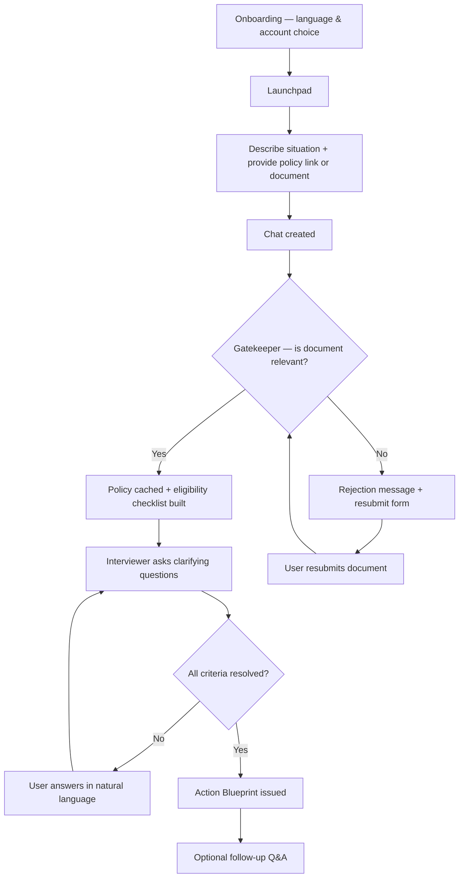
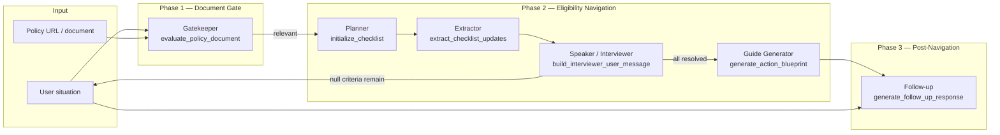
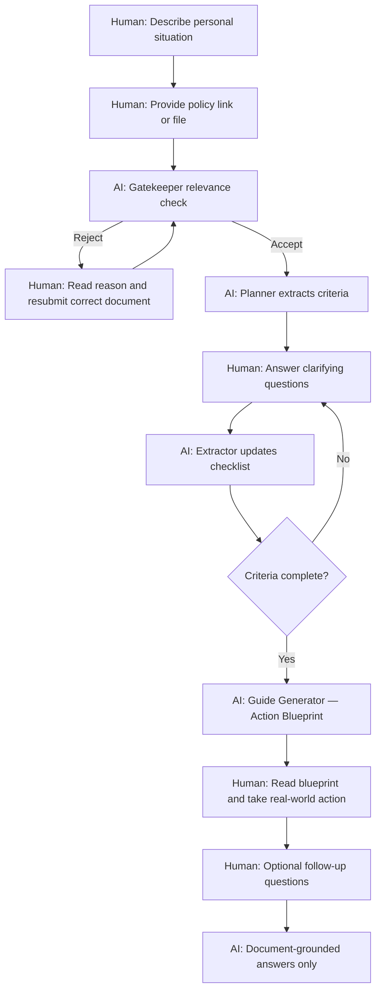
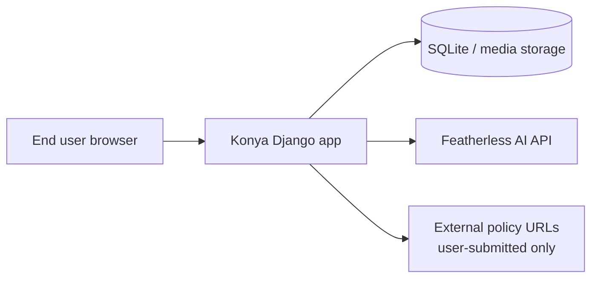

# Konya — Project Submission Document

**Bring Your Own Policy (BYOP) Social-Policy Navigator**

*Prepared for project submission — June 2026*

---

## Table of Contents

1. [Complete Project Description](#1-complete-project-description)
2. [AI Architecture Explanation](#2-ai-architecture-explanation)
3. [Human-in-the-Loop Design](#3-human-in-the-loop-design)
4. [Responsible AI Guardrails](#4-responsible-ai-guardrails)
5. [Tools and Data Disclosure](#5-tools-and-data-disclosure)

---

## 1. Complete Project Description

### 1.1 Problem Statement

Accessing social policy programs—grants, benefits, leave entitlements, registration schemes—is often difficult because official rules are buried in long documents, scattered across websites, or written in language that is hard to interpret. Users may not know whether a program applies to them, what they need to prepare, or where to go next. Misreading policy can waste time, cause missed deadlines, or lead to incorrect assumptions about eligibility.

### 1.2 Solution Overview

**Konya** is a web-based **Bring Your Own Policy (BYOP)** navigator. Instead of relying on a generic knowledge base, Konya reads the **exact policy document or official link the user provides**, checks whether it is relevant to their situation, extracts eligibility rules, asks focused clarifying questions, and produces a structured **Action Blueprint** with a conclusion and practical next steps.

Konya is an **informational guide**, not an adjudicator. It does not submit applications, grant benefits, or replace official government or institutional decisions.

### 1.3 Target Users

- Individuals navigating social programs (e.g., maternity leave, grants, registration, benefits)
- Users who have found a policy page or document but need help understanding how it applies to them
- Speakers of **English**, **Kiswahili**, and **Sheng** (Kenyan urban mixed language)

### 1.4 Core User Journey



**Step-by-step flow:**

1. **Onboarding (once per user/session)** — Introduction, language selection (English / Kiswahili / Sheng), and choice to sign up, log in, or continue as guest.
2. **Launchpad** — User describes their personal situation and supplies a policy URL and/or document (PDF, Word, text, or image).
3. **Gatekeeper** — AI checks topical relevance only. Irrelevant documents are rejected with clear guidance; the user can resubmit.
4. **Navigation** — Eligibility criteria are extracted from the policy. Konya asks questions until each criterion is resolved.
5. **Action Blueprint** — A structured Markdown report with Conclusion, What You Need to Prepare, and Next Steps.
6. **Follow-up** — User may ask additional questions; answers are limited to the verified policy document.

### 1.5 Key Features

| Feature | Description |
|---------|-------------|
| BYOP model | All guidance is grounded in user-supplied policy text, not invented rules |
| Multilingual UI & AI copy | English, Kiswahili, and Sheng across interface and navigator messages |
| Document flexibility | PDF, .docx, .txt, and images accepted; URLs fetched and parsed |
| Guest & authenticated modes | Guests use session-based chats; accounts persist language and onboarding |
| Rejection UX | Clear resubmit card, escalating guidance on repeated wrong documents, no duplicate messages |
| Error recovery | Regenerate button on AI failures; inline AJAX errors without page reload |
| Rate limiting | Protects AI endpoints from abuse (10–45 requests/minute per endpoint) |

### 1.6 What Konya Does Not Do

- Does not submit applications on behalf of users
- Does not guarantee eligibility outcomes
- Does not provide legal advice
- Does not use a proprietary policy database—the user must supply the source document
- Does not perform OCR on image uploads in the current MVP (images rely on contextual evaluation)

### 1.7 Technology Summary

| Layer | Technology |
|-------|------------|
| Backend | Django 5.2 (Python) |
| Database | SQLite (development) |
| AI | Featherless AI — OpenAI-compatible chat completions API |
| Default model | `meta-llama/Meta-Llama-3.1-8B-Instruct` |
| Frontend | Django templates, Tailwind CSS, vanilla JavaScript |
| Document parsing | pypdf, python-docx, BeautifulSoup, requests |
| Internationalization | Django gettext (`locale/en`, `locale/sw`, `locale/sheng`) |

---

## 2. AI Architecture Explanation

### 2.1 Design Philosophy

Konya uses a **multi-agent, phased pipeline** rather than a single monolithic chatbot. Each phase has a narrow responsibility, explicit inputs and outputs, and clear handoff conditions. This reduces hallucination risk, improves debuggability, and allows template-based copy where predictability matters (e.g., interviewer questions).

All orchestration lives in `navigator/services/featherless_ai.py`. The main entry point for chat AI is `generate_chat_ai_response()`.

### 2.2 Architecture Diagram



### 2.3 Agent Roles and Responsibilities

#### Phase 1: Gatekeeper

| Property | Detail |
|----------|--------|
| **Function** | `evaluate_policy_document()` |
| **Model use** | LLM (JSON output) |
| **Purpose** | Determine whether the submitted document is **topically relevant** to the user's stated situation |
| **Critical rule** | A document that disqualifies the user is still **relevant** if it contains rules that answer their question |
| **Output** | `{ "is_relevant": true/false, "reason": "..." }` |
| **On reject** | Localized rejection message via `build_gatekeeper_rejection_message()`; `is_gatekeeper=True` on message |
| **On accept** | `has_valid_document=True`; policy text cached in `Chat.cached_policy_text` |

The Gatekeeper intentionally separates **relevance** from **outcome**. A hackathon rules page that says "solo entries not allowed" is relevant to a user asking "Can I enter alone?" even though the answer is negative.

#### Phase 2a: Planner

| Property | Detail |
|----------|--------|
| **Function** | `initialize_checklist()` |
| **Model use** | LLM (JSON output) |
| **Purpose** | Extract qualifying eligibility criteria from verified policy text |
| **Runs** | Once after document approval |
| **Output** | `eligibility_state` JSON: `checklist`, `criteria_meta`, `resolved_sources`, `planner_completed` |
| **Language** | Criterion labels generated in the user's selected language |

The Planner does **not** extract application logistics (IDs, signatures) at this stage—only logical eligibility conditions.

#### Phase 2b: Extractor

| Property | Detail |
|----------|--------|
| **Function** | `extract_checklist_updates()` |
| **Model use** | LLM (JSON output) |
| **Purpose** | Parse the user's natural-language reply and update checklist values (`true`, `false`, or omit if unknown) |
| **Guardrail** | Prompt instructs: do not invent facts the user did not state |

#### Phase 2c: Interviewer (Speaker)

| Property | Detail |
|----------|--------|
| **Function** | `build_interviewer_user_message()` via `run_interviewer_loop()` |
| **Model use** | **No LLM** — template-based, gettext-localized copy |
| **Purpose** | Ask the next clarifying question(s) in predictable, translatable language |
| **Behavior** | Single question when ≤2 unknown criteria; bulk list on first turn when many remain; thanks user when criteria are resolved |

Separating the **Speaker** from the **Extractor** keeps user-facing questions stable and fully translatable, while the LLM handles unstructured answer parsing.

#### Phase 2d: Guide Generator (Action Blueprint)

| Property | Detail |
|----------|--------|
| **Function** | `generate_action_blueprint()` |
| **Model use** | LLM (Markdown output) |
| **Trigger** | All checklist criteria resolved (`is_ready_for_blueprint()`) |
| **Output** | Structured Markdown: **Conclusion**, **What You Need to Prepare**, **Next Steps** |
| **Language** | Explicit directive to write entirely in user's language |
| **State** | Sets `navigation_complete=True` |

#### Phase 3: Follow-up

| Property | Detail |
|----------|--------|
| **Function** | `generate_follow_up_response()` |
| **Model use** | LLM (Markdown output) |
| **Purpose** | Answer post-blueprint questions **only** from `cached_policy_text` |
| **Fallback** | Safe refusal message when document cannot support an answer |

#### Auxiliary Calls

| Function | Purpose |
|----------|---------|
| `generate_chat_title()` | Short sidebar title from opening message |
| `get_ai_error_message()` | Localized connection-failure copy |
| `_call_featherless()` | Shared HTTP client to Featherless API |

### 2.4 State Management

Internal navigation state is stored in `Chat.eligibility_state` (JSON) and is **never shown directly** to users. Users only see natural-language messages in the chat thread.

Key fields:

- `checklist` — `{ criterion_key: true | false | null }`
- `criteria_meta` — human-readable labels and policy source quotes
- `resolved_sources` — provenance of each answer
- `action_blueprint` — final Markdown report
- `navigation_complete` — gates follow-up mode

Gatekeeper rejection messages are excluded from Phase 2 conversation history via `is_gatekeeper_message()` so irrelevant documents do not pollute eligibility reasoning.

### 2.5 API Configuration

| Environment variable | Default | Role |
|---------------------|---------|------|
| `FEATHERLESS_API_KEY` | — | Authentication |
| `FEATHERLESS_MODEL` | `meta-llama/Meta-Llama-3.1-8B-Instruct` | Model selection |
| `FEATHERLESS_TIMEOUT` | `120` | Request timeout (seconds) |
| `FEATHERLESS_MAX_TOKENS` | `1024`–`2048` | Token limit per call |
| `FEATHERLESS_TEMPERATURE` | `0.1`–`0.3` | Low temperature for structured extraction; slightly higher for blueprint prose |

Temperature is kept low for JSON agents (Gatekeeper, Planner, Extractor) to improve consistency. The Guide Generator uses moderate temperature for readable but structured output.

---

## 3. Human-in-the-Loop Design

Human-in-the-loop (HITL) is central to Konya. The system is designed so that **users remain the authoritative source of their situation** and **policy documents remain user-supplied evidence**, while AI assists with reading, structuring, and explaining—not deciding on their behalf.

### 3.1 Human-in-the-Loop Principles

| Principle | How Konya Implements It |
|-----------|-------------------------|
| **User supplies evidence** | Every navigation starts with the user's situation text and their chosen policy URL or document. Konya does not select policy on the user's behalf. |
| **User confirms facts** | The Interviewer explicitly asks the user to confirm or clarify each unresolved eligibility criterion. The Extractor only updates checklist values from what the user stated. |
| **User can correct mistakes** | Wrong document? User resubmits via the rejection card. AI error? User clicks **Regenerate Response**. |
| **User controls pace** | Chat input is blocked until a valid document is approved; thereafter the user answers at their own pace. |
| **User chooses language** | Language is selected during onboarding and can be changed in the sidebar; all navigator copy respects this choice. |
| **User decides next action** | The Action Blueprint recommends steps; the user must physically submit paperwork to the relevant authority. |

### 3.2 Decision Points Requiring Human Input



### 3.3 Explicit Human Checkpoints

1. **Document submission (Launchpad & resubmit)**  
   The user must actively provide or replace the policy source. The Gatekeeper may reject it, but only the user can supply a better document.

2. **Eligibility clarification loop**  
   Each `null` value in the checklist represents an unknown the AI cannot infer. The Interviewer asks; the user must answer. The Extractor is instructed not to invent facts.

3. **Opening situation as initial evidence**  
   The Planner may pre-fill checklist values from the user's first message, but ambiguous cases remain `null` until the user confirms.

4. **Post-blueprint follow-up**  
   Users choose whether to ask further questions. The AI cannot restart the interview or change prior conclusions without user initiation.

5. **Account vs. guest choice**  
   Users explicitly choose persistence model: guest (browser session) or authenticated account (saved profile and chats).

### 3.4 What AI Does Autonomously (Without Further Human Input)

To be transparent, these steps run automatically once triggered:

- Chat title generation
- Gatekeeper relevance evaluation
- Planner checklist extraction
- Extractor parsing of each user reply
- Action Blueprint generation when all criteria are resolved

These are **assistive automations** bounded by strict prompts, JSON schemas, and state checks—not open-ended autonomous agents.

### 3.5 Failure Modes and Human Recovery

| Failure | Human action available |
|---------|------------------------|
| Irrelevant document | Resubmit with guidance from escalating rejection copy |
| Empty planner (no criteria extracted) | User sees clear message to try a more complete policy page |
| API / connection error | Regenerate Response button; localized error message |
| Rate limit (HTTP 429) | User waits and retries |

---

## 4. Responsible AI Guardrails

Konya implements responsible AI practices across **data grounding**, **scope limitation**, **transparency**, **safety refusals**, and **operational controls**.

### 4.1 Guardrail Summary Table

| Category | Guardrail | Implementation |
|----------|-----------|----------------|
| **Grounding** | BYOP only | All rules come from `cached_policy_text` after Gatekeeper approval |
| **Grounding** | No outside knowledge in follow-up | `FOLLOW_UP_SYSTEM_PROMPT` restricts answers to verified document |
| **Scope** | No application submission | Prompts and UI state prevent Konya from acting as an application agent |
| **Scope** | Informational disclaimer | Action Blueprint ends with reminder that user must submit to official authority |
| **Accuracy** | Separated relevance vs. outcome | Gatekeeper cannot reject disqualifying-but-relevant documents |
| **Accuracy** | No invented user facts | Extractor prompt: omit unknown keys; do not invent facts |
| **Transparency** | Structured blueprint | Conclusion, preparation list, and next steps in fixed headings |
| **Safety** | Safe refusal | Follow-up returns localized refusal when document cannot support an answer |
| **Privacy** | Chat ownership | `get_chat_for_request()` enforces user/session isolation |
| **Abuse** | Rate limiting | 10–45 req/min on AI-heavy endpoints |
| **Language** | Localized error & rejection copy | gettext translations for predictable user-facing messages |

### 4.2 Document Grounding (BYOP)

**Rule:** Konya never invents eligibility rules.

- Policy text is extracted from the user's URL or upload, truncated to safe length limits, and cached after Gatekeeper approval.
- The Planner reads only this verified text.
- The Guide Generator receives the final checklist, opening situation, conversation history (excluding gatekeeper/errors), and verified policy.
- Follow-up mode requires `navigation_complete=True` and uses `cached_policy_text` as the sole knowledge source.

### 4.3 Prompt-Level Guardrails

#### Gatekeeper
- Evaluates **topical relevance only**, not whether the user qualifies.
- Must not reject documents because the outcome is negative or unfavorable.
- Returns strict JSON; user-facing copy is built separately via localized templates.

#### Planner
- Extracts **logical eligibility conditions only**—not logistics like "bring your ID" at this stage.
- Outputs strict JSON with snake_case keys and localized labels.

#### Extractor
- Updates only keys present in the pending checklist.
- Omits unknown values rather than guessing.
- Uses low temperature (0.1) for deterministic parsing.

#### Guide Generator
- Required Markdown structure prevents vague or unstructured advice.
- Must include disclaimer that this is a guide, not an official application.
- Language directive ensures output matches user's selected language.

#### Follow-up
Strict rules in system prompt:
1. Answer only from verified policy document.
2. No outside knowledge or assumptions.
3. Refuse safely when document does not support an answer; suggest official channels.
4. Do not restart interviews or change prior conclusions.
5. Do not offer to submit applications on user's behalf.

Code-level fallback when LLM returns empty response:
```text
"I can't answer that safely from the policy document alone. Please check the
official program website or contact the relevant office for confirmation."
```
(This message is localized in English, Kiswahili, and Sheng.)

### 4.4 UX-Level Guardrails

- **Input lock until valid document** — Prevents navigation on unverified policy text.
- **Gatekeeper message isolation** — Rejections excluded from eligibility reasoning history.
- **Escalating rejection guidance** — Attempt 1: specific reason; Attempt 2: search guidance; Attempt 3+: trusted-source guidance.
- **No duplicate rejection in thread** — Active rejection lives in resubmit card only; historical rejections appear after resubmit.
- **Error messages marked** — `is_error=True` enables regenerate without silent retry loops.

### 4.5 Data and Security Guardrails

- CSRF protection on all forms and AJAX requests
- File type validation (`document_files.py`) — PDF, Word, text, images only
- Policy text length truncation before LLM calls
- Session-based guest isolation; authenticated user ownership on chats
- Admin interface for operational review of chats and messages (debugging and oversight)

### 4.6 Known Limitations (Transparent Disclosure)

| Limitation | Mitigation / user impact |
|------------|--------------------------|
| Image uploads have no OCR | Gatekeeper and planner rely on available text; users should prefer PDF/URL when possible |
| LLM may misread complex policy | User confirms each criterion in the interview loop |
| URL fetching has no SSRF hardening in MVP | Production deployment should add URL allowlisting |
| SQLite in development | Production should use PostgreSQL |
| Model hallucination risk | BYOP grounding, JSON agents, template speaker, safe refusals in follow-up |

---

## 5. Tools and Data Disclosure

### 5.1 Development Tools and Platforms

| Tool / Platform | Role in Project |
|-----------------|-----------------|
| **Python 3** | Primary programming language |
| **Django 5.2** | Web framework, ORM, auth, i18n, admin |
| **SQLite** | Development database |
| **Featherless AI** | LLM inference API (OpenAI-compatible chat completions) |
| **Meta Llama 3.1 8B Instruct** | Default model via Featherless |
| **Tailwind CSS (CDN)** | Styling and responsive layout |
| **marked.js** | Client-side Markdown rendering in chat |
| **pypdf** | PDF text extraction |
| **python-docx** | Word document text extraction |
| **BeautifulSoup4 + requests** | Policy URL fetching and HTML text extraction |
| **python-dotenv** | Environment variable management |
| **Django gettext** | Internationalization (en, sw, sheng) |
| **Git** | Version control |
| **Cursor** | AI-assisted development environment used throughout the project for code authoring, refactoring, debugging, documentation, and implementation of features such as the gatekeeper workflow, multilingual AI copy, rate limiting, and submission documentation |

### 5.2 Cursor as Development Assistant

**Cursor** was used as an AI pair-programming assistant during the entire build of Konya. Its role included:

- Implementing and refactoring the multi-phase AI pipeline (`featherless_ai.py`)
- Designing gatekeeper rejection UX and resubmit flows
- Adding internationalization for UI and AI-facing template messages
- Fixing bugs (e.g., checklist state persistence, gatekeeper relevance logic, language consistency)
- Writing technical documentation (`konya-documentation.md`, this submission document)
- Code review-style iteration on views, templates, and JavaScript chat behavior

**Important distinction:** Cursor assisted **developers in writing Konya**. It is **not** part of the runtime product experienced by end users. End-user-facing AI is powered exclusively by **Featherless AI** with the configured Llama model, operating within the guardrails described in Section 4.

### 5.3 Runtime AI Services

| Service | Data sent | Purpose |
|---------|-----------|---------|
| **Featherless AI API** | User situation text, extracted policy text (truncated), conversation messages (excluding gatekeeper/errors where applicable), checklist JSON, language directives | Gatekeeper, Planner, Extractor, Guide Generator, Follow-up, chat title |

**API endpoint:** OpenAI-compatible chat completions via Featherless (`FEATHERLESS_API_URL` in application config).

**Data minimization practices:**
- Policy text truncated before LLM calls (`MAX_POLICY_TEXT_LENGTH`, `MAX_URL_TEXT_LENGTH`)
- Gatekeeper uses a lightweight preview for initial check; full text cached only after approval
- Low max_tokens on title and gatekeeper calls

### 5.4 Data Collected and Stored

#### User-provided data

| Data type | Storage | Retention |
|-----------|---------|-----------|
| Situation description | `Message.content` | Until chat deleted |
| Policy URL | `Message.attached_url` | Until chat deleted |
| Policy document file | `media/policy_docs/` + message reference | Until chat deleted |
| Chat title | `Chat.title` | Until chat deleted |
| Language preference | Session + `UserProfile.preferred_language` | Session or account lifetime |
| Onboarding status | Session + `UserProfile.onboarding_completed` | Session or account lifetime |

#### System-generated data

| Data type | Storage | Purpose |
|-----------|---------|---------|
| `cached_policy_text` | `Chat` model | Grounding for planner, blueprint, follow-up |
| `eligibility_state` | `Chat` model (JSON) | Internal checklist and navigation state |
| AI messages | `Message` model | Chat history display |
| Gatekeeper flags | `Message.is_gatekeeper` | UX and history filtering |

#### Authentication data

| Data type | Storage |
|-----------|---------|
| Email, password hash | Django `User` model (if registered) |
| Session key | Django sessions (guests) |

#### Data not collected (current MVP)

- No analytics telemetry SDK in core navigator flow
- No payment data
- No biometric data
- OAuth (Google/Apple) buttons present but disabled during MVP testing

### 5.5 Third-Party Data Flows



- **Featherless AI:** Receives prompts constructed from user content for inference. Governed by Featherless terms and API key configuration.
- **External URLs:** Fetched server-side when user submits a policy link. No URL allowlist in MVP (disclosed limitation).
- **Cursor:** Used only during development; no end-user data is sent to Cursor at runtime.

### 5.6 Open Source and Dependencies

Key Python dependencies (`requirements.txt`):

```
Django>=5.0,<6.0
python-dotenv>=1.0.0
requests>=2.31.0
pypdf>=4.0.0
python-docx>=1.1.0
beautifulsoup4>=4.12.0
markdown>=3.5.0
```

Frontend libraries loaded via CDN: Tailwind CSS, marked.js (as configured in templates).

### 5.7 Environment Variables Required

```env
SECRET_KEY=...
DEBUG=True
ALLOWED_HOSTS=localhost,127.0.0.1
FEATHERLESS_API_KEY=...
FEATHERLESS_MODEL=meta-llama/Meta-Llama-3.1-8B-Instruct
FEATHERLESS_TIMEOUT=120
FEATHERLESS_MAX_TOKENS=2048
FEATHERLESS_TEMPERATURE=0.3
```

### 5.8 Ethical Positioning Statement

Konya is designed to **reduce information barriers** in social policy navigation while **avoiding overclaiming**. It assists users in reading and structuring policy they already found; it does not replace official adjudication, legal counsel, or government decision-making. Human judgment, official submission, and verification with relevant authorities remain essential steps in any real-world outcome.

---

## Appendix: Quick Reference

| Document | Purpose |
|----------|---------|
| `konya-documentation.md` | Technical developer documentation (routes, models, implementation detail) |
| `konya-submission.md` | This submission document (description, AI architecture, HITL, guardrails, disclosure) |

**Repository structure:** `config/`, `accounts/`, `navigator/`, `locale/`, `media/`

**Primary AI module:** `navigator/services/featherless_ai.py`

---

*Konya — Bring Your Own Policy. Navigate with evidence, confirm with clarity, act with confidence.*
